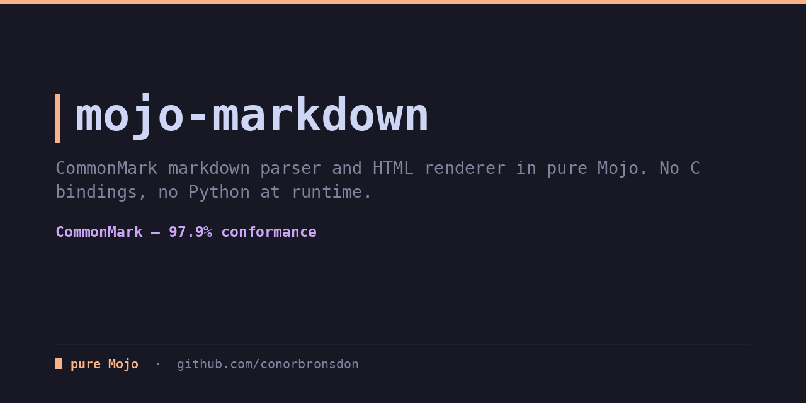

<div align="center">

# mojo-markdown

**CommonMark parsing and HTML rendering in pure Mojo. 98.6% spec conformance, no Python dependencies.**

[](LICENSE)
[](https://mojolang.org)
[](https://chainofthought.show)
[](https://x.com/ConorBronsdon)



</div>

As of mid-2026 the Mojo ecosystem has no markdown parser. mojo-markdown fills
that gap: a byte-level CommonMark parser and HTML renderer, source to output,
with no C bindings and no Python at runtime. The Emphasis section of the
CommonMark spec is where markdown parsers go to die: 132 examples of
flanking rules, the multiple-of-3 rule, and nested delimiter runs. This one
passes all 132. I built it to run alongside mojo-feed and mojo-captions in
the content pipeline behind Chain of Thought.

## What it handles

- **Blocks**: ATX and setext headings, paragraphs with lazy continuation,
  fenced code blocks (info string maps to `class="language-x"`) and
  indented code blocks, blockquotes (nested), ordered and unordered lists
  (nested, tight/loose semantics per spec), thematic breaks, HTML blocks
  (types 1–7), link reference definitions (full, collapsed, and shortcut
  forms)
- **Inlines**: code spans, emphasis and strong (`*` and `_`) resolved with
  a delimiter stack against the full flanking rules and the rule-of-3,
  inline links and images, reference links, autolinks (URI and email),
  backslash escapes, hard and soft line breaks, raw inline HTML
  passthrough, numeric character references, and entity escaping of output
- **Links inside links**, resolved per spec: bracket delimiters carry
  active/inactive flags, so a `]` closes against the nearest active
  `[`/`![` and forming a link deactivates every earlier `[` opener
- `render_html()` for the common case, plus a public block-level AST
  (`parse_blocks`) for anyone who wants to walk the tree instead

## What it deliberately does NOT do

- **Preserve literal tabs inside code and text content.** CommonMark
  expands tabs to 4-column stops only virtually, to compute block-structure
  indentation, then keeps the original byte. This parser expands tabs to
  spaces up front during preprocessing, which is simpler but changes the
  literal bytes of tab-containing code blocks (4 spec examples).
- **Apply full Unicode case folding to reference labels and emphasis
  flanking.** Matching uses ASCII case folding, so `[ẞ]` does not match
  `[SS]` and `[ΑΓΩ]` does not match `[αγω]`. Full folding needs a
  ~1,500-entry table that stays out of a byte-level v0.1 (2 examples).
- **Ship the full ~2,200-name HTML5 entity table.** Numeric references
  (`&#35;`, `&#x22;`) are fully supported; a common subset of named
  entities is included, but exotic names like `&ClockwiseContourIntegral;`
  are not (1 example).
- **Fully model container laziness.** A setext underline lazily continuing
  a quoted paragraph, and list markers indented exactly 4 columns under a
  chain of one-space-increment markers, both need per-line column state
  that the line-string container model doesn't carry (2 examples).

That's 9 of 652 spec examples, all documented, none silent.

## Install

With [pixi](https://pixi.prefix.dev):

```bash
pixi install
pixi run test
```

Or with uv:

```bash
uv venv
uv pip install mojo --index https://whl.modular.com/nightly/simple/ --prerelease allow
.venv/bin/mojo run -I src test/test_markdown.mojo
```

Requires a Mojo nightly (`>=1.0.0b3`).

## Usage

```mojo
from markdown import render_html

def main() raises:
    print(render_html("# Hello\n\nSome *emphasis* and a [link](https://example.com)."))
```

The block-level AST is public too:

```mojo
from markdown import parse_blocks, B_HEADING

def main() raises:
    var tree = parse_blocks("# Title\n\nBody text.")
    for child in tree.nodes[tree.root].children:
        if tree.nodes[child].kind == B_HEADING:
            print("heading:", tree.nodes[child].text)
```

`BlockTree` is an arena: `nodes` holds every block, and each block's
`children` field lists its children's indices. Inline content stays
unparsed in `Block.text` until `render_inlines` converts it to HTML.

## Tests & conformance

```bash
pixi run test          # 48 unit tests, must pass completely
pixi run conformance    # spec scoreboard, 643/652 (98.6%)
```

The conformance runner is a scoreboard, not a gate. It prints per-section
pass counts and never fails the build. Highlights: Emphasis and strong
emphasis 132/132, HTML blocks 44/44, List items 48/48. The 9 remaining
failures are the four divergences documented above.

Robustness is checked with a fuzz runner (`pixi run fuzz`) against the spec
corpus and adversarial inputs: deep bracket nesting, long delimiter runs,
deep blockquotes. Container nesting (blockquotes and list items) is capped
at 256 levels. Beyond that, `>` and list markers are treated as ordinary
paragraph text instead of recursing further, which bounds stack usage on
pathological input (thousands of leading `>`) without affecting any
realistic document.

## Part of a pure-Mojo library suite

Nine pure-Mojo libraries that mirror familiar Python stdlib and PyPI APIs,
filling gaps in the native Mojo ecosystem:

- [mojo-feed](https://github.com/conorbronsdon/mojo-feed) — RSS, Atom, and
  JSON Feed parsing (Python's `feedparser`)
- [mojo-captions](https://github.com/conorbronsdon/mojo-captions) — SRT and
  WebVTT subtitle/transcript parsing (no Python stdlib parallel)
- [mojo-html](https://github.com/conorbronsdon/mojo-html) — HTML parsing and
  article extraction (Python's readability)
- [mojo-unicodedata](https://github.com/conorbronsdon/mojo-unicodedata) —
  Unicode normalization and case folding (Python's `unicodedata`)
- [mojo-diff](https://github.com/conorbronsdon/mojo-diff) — text diffing
  (Python's `difflib`)
- [mojo-template](https://github.com/conorbronsdon/mojo-template) — a
  Jinja-flavored template engine (Python's `jinja2`)
- [mojo-tar](https://github.com/conorbronsdon/mojo-tar) — tar archive
  reading and writing (Python's `tarfile`)
- [mojo-redis](https://github.com/conorbronsdon/mojo-redis) — a Redis
  client (Python's `redis-py`)

## Contributing

Issues and PRs welcome, especially spec examples that fail outside the
four documented divergences and real-world markdown that renders wrong.
Run `pixi run test` before sending a PR.

## About

Built by [Conor Bronsdon](https://conorbronsdon.com) — host of
[Chain of Thought](https://chainofthought.show), a podcast about AI agents,
infrastructure, and engineering. This library exists to render that show's
own content. Find me on [X](https://x.com/ConorBronsdon) or
[LinkedIn](https://www.linkedin.com/in/conorbronsdon).


---

## Disclaimer

*All views, opinions, and statements expressed on this account/in this repo are solely my own and are made in my personal capacity. They do not reflect, and should not be construed as reflecting, the views, positions, or policies of Modular. This account is not affiliated with, authorized by, or endorsed by my employer in any way.*

## License

Licensed under the [MIT License](LICENSE).
